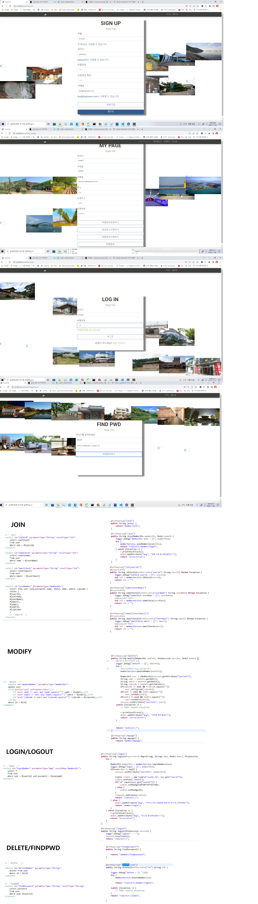

# 1. 기본(필수) 기능 : 관광지 정보 관리

## 1. 메인페이지 

DB에서 랜덤하게 20장의 사진을 가져와 랜덤하게 배치.

## 2. 지역별 관광지 검색 기능 구현

키워드, 지역별, 시군구, 장소테마(음식점, 관광지..) 등 검색 기능 

## 3,4. 회원정보 등록, 수정, 삭제, 조회 / 로그인, 로그아웃 기능 구현

회원정보 등록,수정,삭제,조회 및 비밀번호 찾기기능

추후 이메일인증, 관심장소 수정 등의 기능 추가 예정.

# 2.추가 기능:
## 1. 여행 계획 추가.

게시물로 여행계획을 올릴수있음.
관광지에 플러스 버튼으로 검색한 장소를 추가. 지도에 여행경로 표시.

# 3. 심화 기능:
## 1. 게시판 관리 기능

추가기능 마지막 사진에서 여행공유 버튼을 누르면 게시판에 추가됨.

# 4. CLASS DIAGRAM

## 1. member

## 2. attraction/plan

## 3. board

# 5. USECASE DIAGRAM
